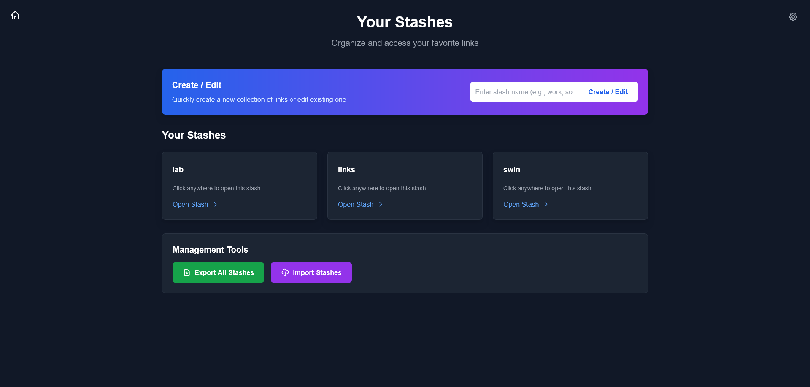
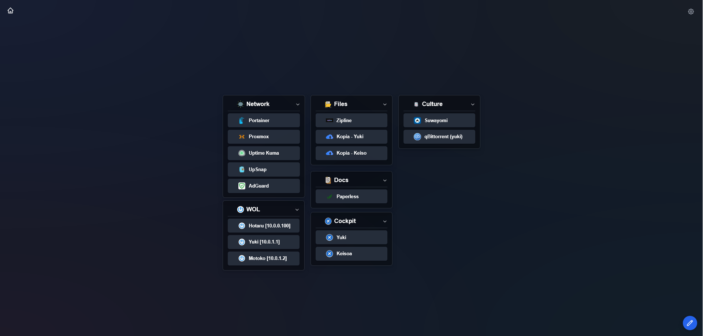
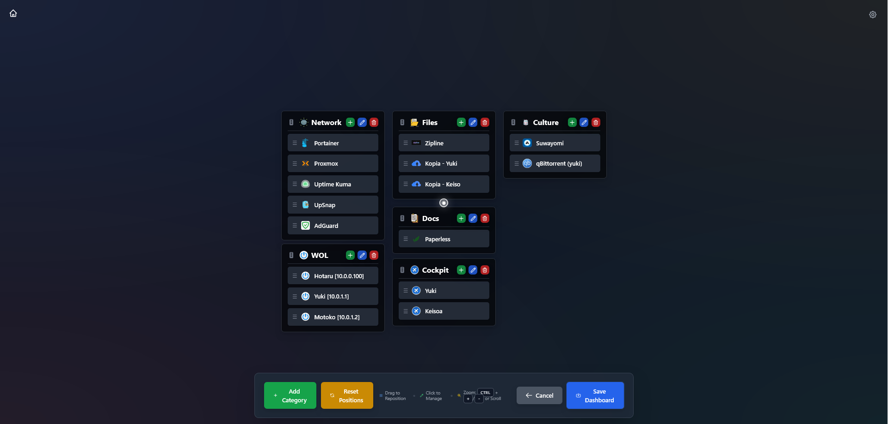
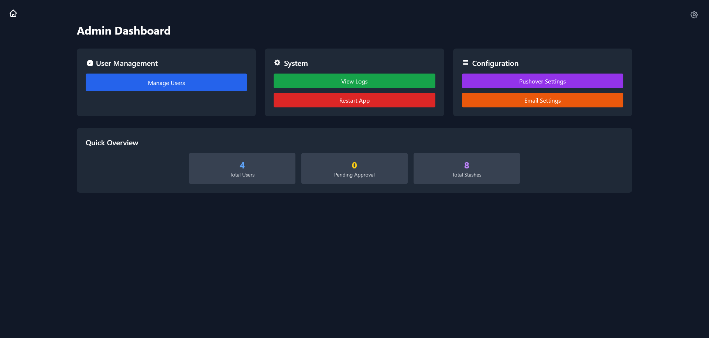

# Stashpage
Stashpage is a modern, self-hosted bookmark management system with an intuitive drag-and-drop dashboard for organizing links into customizable categories. Built with Perl/Mojolicious backend and vanilla JavaScript frontend, it features user authentication, admin controls, data import/export, and a responsive glass-morphism UI design.

Perfect for homelab enthusiasts and teams who want to centrally manage and access their bookmarks with enterprise-grade features and beautiful design.

## Features
* **🖱️ Drag & Drop Interface**: Intuitive dashboard with smooth drag-and-drop functionality for organizing categories and links
* **👥 User Management**: Complete authentication system with registration, login, and admin controls
* **🎨 Modern UI**: Beautiful glass-morphism design with dark theme and gradient backgrounds
* **📱 Responsive Design**: Optimized for desktop, tablet, and mobile devices
* **🔧 Admin Controls**: Comprehensive admin panel for user management, system monitoring, and configuration
* **💾 Data Management**: Import/export functionality for backing up and migrating bookmark collections
* **⚡ High Performance**: Built with Perl/Mojolicious for fast server-side processing
* **🎯 Category Organization**: Hierarchical bookmark organization with icons and custom categories
* **🔒 Secure**: Password hashing, session management, and security best practices built-in

## Screenshots

### Dashboard View

*Main dashboard showing multiple bookmark categories*

### Stash View

*Detailed view of a stash page with organized bookmark collections*

### Edit Mode

*Edit mode interface for customizing categories and managing bookmarks*

### Admin Panel

*Administrative interface for user management and system configuration*

## Quick Start

### Manual Installation
1. **Prerequisites**:
   - Perl 5.24+
   - MariaDB/MySQL
   - cpanm (for installing Perl modules)

2. **Install dependencies**:
   ```
   cpanm --installdeps .
   ```

3. **Database setup**:
   ```
   mysql -u root -p < database/schema.sql
   ```

4. **Configure environment**:
   ```
   export DB_USER=your_db_user
   export DB_PASS=your_db_password
   export DB_HOST=localhost
   export DB_NAME=stashpage
   ```

5. **Start the application**:
   ```
   morbo script/stashpage
   ```

## Configuration

### Environment Variables
```
DB_HOST=localhost          # Database host
DB_NAME=stashpage         # Database name
DB_USER=stashpage         # Database username
DB_PASS=your_password     # Database password
DB_PORT=3306              # Database port
MOJO_MODE=production      # Application mode (development/production)
MOJO_LISTEN=http://*:3000 # Server listen address
```

### Admin Account
The first user registered automatically becomes an admin. Subsequent users require admin approval.

## Tech Stack
- **Backend**: Perl with Mojolicious framework
- **Frontend**: Vanilla JavaScript (ES6+), HTML5, CSS3
- **Database**: MariaDB/MySQL with DBI
- **Styling**: Custom CSS with Tailwind-inspired utilities
- **Authentication**: Secure session-based auth with bcrypt
- **Drag & Drop**: Native HTML5 Drag API with Sortable.js
- **Icons**: SVG icons and web fonts

## File Structure
```
stashpage/
├── lib/MyApp/           # Perl application modules
├── public/              # Static assets (CSS, JS, images)
├── templates/           # Mojolicious templates
├── script/              # Application startup scripts
├── database/            # Database schema and migrations
├── docker/              # Docker configuration files
└── docs/                # Documentation
```

## Features in Detail

### Dashboard
- **Drag & Drop**: Rearrange categories and bookmarks with smooth animations
- **Category Management**: Create, edit, delete, and organize bookmark categories
- **Link Management**: Add, edit, and organize bookmarks with custom icons
- **Search & Filter**: Quick search across all bookmarks and categories
- **Auto-centering**: Smart viewport centering for optimal viewing

### User Management
- **Registration/Login**: Secure user authentication with email validation
- **Password Reset**: Email-based password recovery system
- **User Profiles**: Customizable user profiles and preferences
- **Admin Controls**: User approval, role management, and system oversight

### Data Management
- **Import/Export**: JSON-based backup and restore functionality
- **Page Cloning**: Duplicate bookmark pages for easy organization
- **Data Validation**: Comprehensive input validation and sanitization
- **URL Resolution**: Smart URL handling with relative path support

## Contributing
1. Fork the repository
2. Create a feature branch (`git checkout -b feature/amazing-feature`)
3. Commit your changes (`git commit -m 'Add some amazing feature'`)
4. Push to the branch (`git push origin feature/amazing-feature`)
5. Open a Pull Request

### Development Setup
```
# Clone and install dependencies
git clone https://github.com/r3ndl3r/stashpage.git
cd stashpage
cpanm --installdeps .

# Start in development mode
morbo script/stashpage
```

## License
This project is licensed under the GPL-3.0 License - see the [LICENSE](LICENSE) file for details.

## Support
- 📖 [Documentation](https://github.com/r3ndl3r/stashpage/wiki)
- 🐛 [Bug Reports](https://github.com/r3ndl3r/stashpage/issues)
- 💬 [Discussions](https://github.com/r3ndl3r/stashpage/discussions)

## Roadmap
- [ ] Themes and customization
- [ ] Advanced search and filtering

---

**Made with ❤️ for the homelab community**
