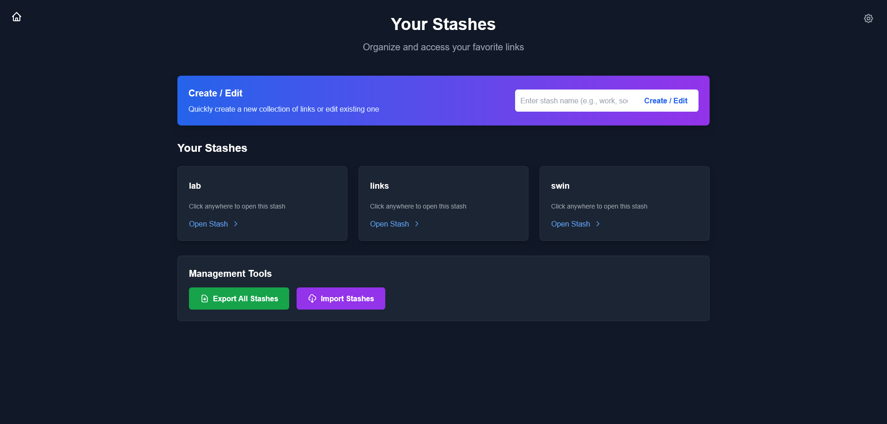
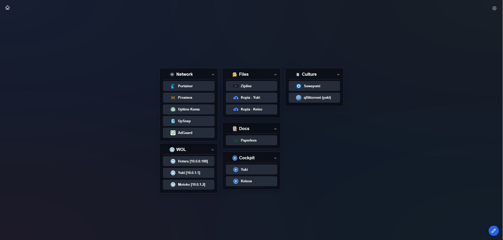
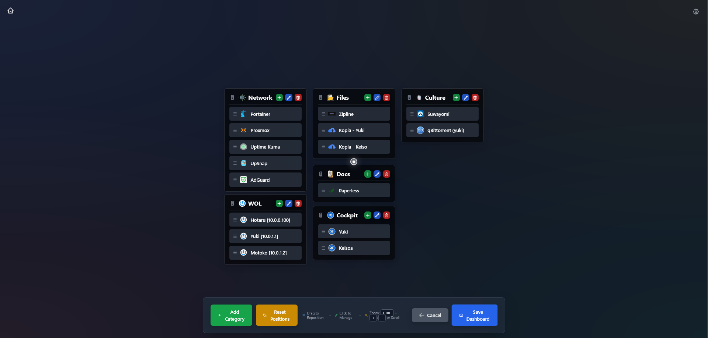
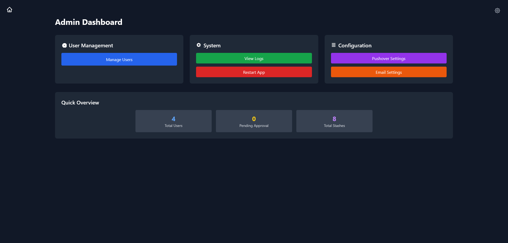

# Stashpage
Stashpage is a modern, self-hosted bookmark management system with an intuitive drag-and-drop dashboard for organizing links into customizable categories. Built with Perl/Mojolicious backend and vanilla JavaScript frontend, it features user authentication, admin controls, data import/export, and a responsive glass-morphism UI design.

Perfect for homelab enthusiasts and teams who want to centrally manage and access their bookmarks with enterprise-grade features and beautiful design.

## Features
* **🖱️ Drag & Drop Interface**: Intuitive dashboard with smooth drag-and-drop functionality for organizing categories and links
* **👥 User Management**: Complete authentication system with registration, login, and admin controls
* **🎨 Modern UI**: Beautiful glass-morphism design with dark theme and gradient backgrounds
* **📱 Responsive Design**: Optimized for desktop, tablet, and mobile devices
* **🔧 Admin Controls**: Comprehensive admin panel for user management, system monitoring, and configuration
* **💾 Data Management**: Import/export functionality for backing up and migrating bookmark collections
* **⚡ High Performance**: Built with Perl/Mojolicious for fast server-side processing
* **🎯 Category Organization**: Hierarchical bookmark organization with icons and custom categories
* **🔒 Secure**: Password hashing, session management, and security best practices built-in
* **🗄️ Dual Database Support**: Choose between MariaDB (production) or SQLite (development/small deployments)

## 🎮 Live Demo
Try Stashpage without installation:
- **URL**: [https://stash.rendler.org](https://stash.rendler.org)
- **Username**: `demo`
- **Password**: `demo`

*Note: The demo account is read-only. You can explore all features, but changes won't be saved.*

## Screenshots

### Dashboard View

*Main dashboard showing multiple bookmark categories*

### Stash View

*Detailed view of a stash page with organized bookmark collections*

### Edit Mode

*Edit mode interface for customizing categories and managing bookmarks*

### Admin Panel

*Administrative interface for user management and system configuration*

## Features in Detail

### Dashboard
- **Drag & Drop**: Rearrange categories and bookmarks with smooth animations
- **Category Management**: Create, edit, delete, and organize bookmark categories
- **Link Management**: Add, edit, and organize bookmarks with custom icons
- **Auto-centering**: Smart viewport centering for optimal viewing

### User Management
- **Registration/Login**: Secure user authentication with email validation
- **Password Reset**: Email-based password recovery system
- **Admin Controls**: User approval, role management, and system oversight

### Data Management
- **Import/Export**: JSON-based backup and restore functionality
- **Page Cloning**: Duplicate bookmark pages for easy organization

## Quick Start

### 🐳 Docker Deployment

Stashpage uses Docker profiles to support both MariaDB and SQLite backends. The application runs on port **3300** by default.

#### Using Pre-built Images (Recommended)

1. Download the docker-compose.yml file:
```bash
curl -O https://raw.githubusercontent.com/r3ndl3r/stashpage/main/docker-compose.yml
```

2. (Optional) Create a `.env` file to customize settings:
```bash
# Database credentials (MariaDB only)
DB_ROOT_PASSWORD=rootpassword
DB_NAME=stashpage
DB_USER=stashpage
DB_PASSWORD=stashpage

# Application settings
MOJO_MODE=production
MOJO_LOG_LEVEL=info
```

3. Start with Docker Compose using profiles:

**For SQLite** (simpler, no separate database container):
```bash
docker compose --profile sqlite up -d
```

**For MariaDB** (recommended for production):
```bash
docker compose --profile mariadb up -d
```

4. Access Stashpage at **http://localhost:3300**

5. The first registered user automatically becomes the admin.

#### Building from Source

If you want to build the image locally instead of using the pre-built image:

```bash
# Build and optionally push to your own registry
./build-and-push.sh YOUR_GITHUB_USERNAME

# Or build locally without pushing
docker build -t stashpage:local .

# Update docker-compose.yml to use your image
# Then start with profiles as above
```

#### Managing Containers

```bash
# View logs
docker compose --profile sqlite logs -f
# or
docker compose --profile mariadb logs -f

# Stop containers
docker compose --profile sqlite down
# or
docker compose --profile mariadb down

# Update to latest image
docker compose --profile sqlite pull
docker compose --profile sqlite up -d
```

### Manual Installation

#### Option 1: MariaDB
1. **Prerequisites**:
   - Perl 5.24+
   - MariaDB/MySQL
   - cpanm (for installing Perl modules)

2. **Install dependencies**:
   ```
   cpanm --installdeps .
   ```
   or
   ```
   apt-get install libdbd-mariadb-perl libdbi-perl libmojolicious-perl libcrypt-eksblowfish-perl libemail-sender-perl libemail-mime-perl libwww-perl
   ```

3. **Database setup**:
   ```
   mysql -u root -p < database/schema.sql
   ```

4. **Configure environment**:
   ```
   export DB_TYPE=mariadb
   export DB_USER=your_db_user
   export DB_PASS=your_db_password
   export DB_HOST=localhost
   export DB_NAME=stashpage
   ```

5. **Start the application**:
   ```
   ./start
   ```

#### Option 2: SQLite
1. **Prerequisites**:
   - Perl 5.24+
   - SQLite3
   - cpanm (for installing Perl modules)

2. **Install dependencies**:
   ```
   cpanm --installdeps .
   ```
   or
   ```
   apt-get install libdbd-sqlite3-perl sqlite3 libdbi-perl libmojolicious-perl libcrypt-eksblowfish-perl libemail-sender-perl libemail-mime-perl libwww-perl
   ```

3. **Start the application** (database auto-created):
   ```
   export DB_TYPE=sqlite
   ./start
   ```

*That's it! SQLite database is automatically initialized on first run.*

## Configuration

### Environment Variables

#### Common Variables
```
MOJO_MODE=production      # Application mode (development/production)
MOJO_LISTEN=http://*:3000 # Server listen address
```

#### MariaDB Configuration
```
DB_TYPE=mariadb           # Database type (default)
DB_HOST=localhost         # Database host
DB_NAME=stashpage         # Database name
DB_USER=stashpage         # Database username
DB_PASS=your_password     # Database password
DB_PORT=3306              # Database port
```

#### SQLite Configuration
```
DB_TYPE=sqlite            # Database type
DB_FILE=data/stashpage.db # Database file path (optional, auto-created)
```

### Database Selection

Switch between databases using the `DB_TYPE` environment variable:

```
# Use MariaDB
export DB_TYPE=mariadb
./start

# Use SQLite
export DB_TYPE=sqlite
./start
```

### Admin Account
The first user registered automatically becomes an admin. Subsequent users require admin approval.

## Tech Stack
- **Backend**: Perl with Mojolicious framework
- **Frontend**: Vanilla JavaScript (ES6+), HTML5, CSS3
- **Database**: MariaDB/MySQL or SQLite with DBI
- **Styling**: Custom CSS with Tailwind-inspired utilities
- **Authentication**: Secure session-based auth with bcrypt
- **Drag & Drop**: Native HTML5 Drag API with Sortable.js
- **Icons**: SVG icons and web fonts

## File Structure
```
stashpage/
├── lib/MyApp/           # Perl application modules
├── public/              # Static assets (CSS, JS, images)
├── templates/           # Mojolicious templates
├── script/              # Application startup scripts
├── database/            # Database schema and migrations
├── docker/              # Docker configuration files
└── docs/                # Documentation
```

## License
This project is licensed under the GPL-3.0 License - see the [LICENSE](LICENSE) file for details.

---

**Made with ❤️ for the homelab community**
